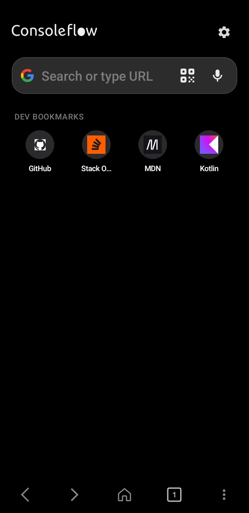
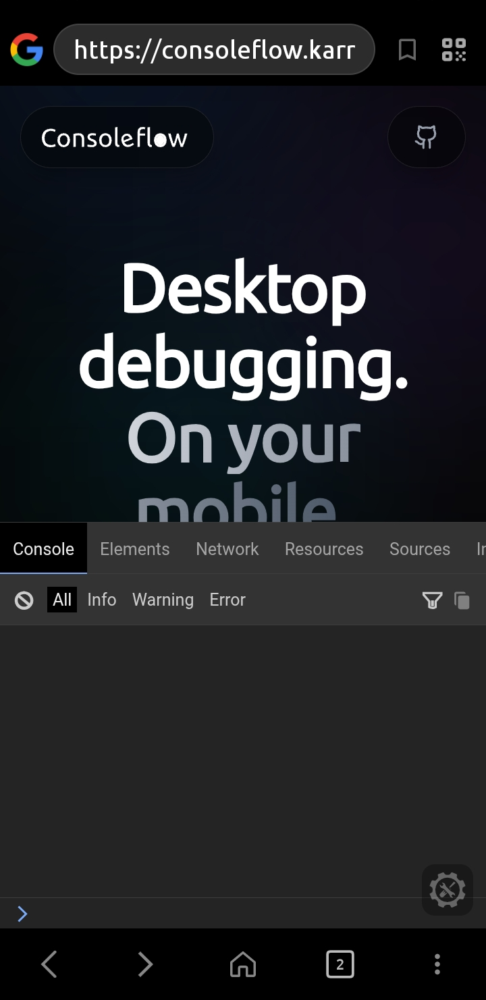
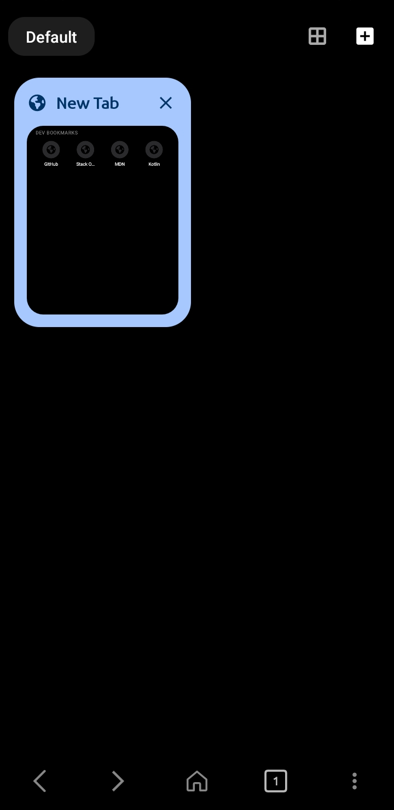
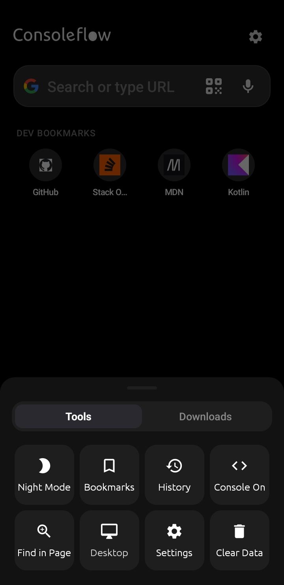

> 💙 **Help renew `karrarnazim.space`**
>
> I'm broke rn, so The domain has expired. If you'd like to help, you can purchase/renew it and transfer it to me pls pls pls.
>
> 📩 Telegram: [@kaarrar](https://t.me/kararar) · Instagram: [@k9k6e](https://instagram.com/k9k6e)

<div align="center">


### Desktop-grade web debugging, in your pocket — or on your TV.

[](LICENSE)
[](https://github.com/ConsoleFlow-Group/ConsoleFlow-mobile/releases)
[](https://f-droid.org/packages/space.karrarnazim.ConsoleFlow/)
[](https://github.com/ConsoleFlow-Group/ConsoleFlow-mobile/actions/workflows/quick-apk.yml)

<a href="https://f-droid.org/packages/space.karrarnazim.ConsoleFlow/">
  
</a>

<br clear="all">

| Home | Auto-injected console | Tab groups | Quick tools |
|:---:|:---:|:---:|:---:|
|  |  |  |  |

</div>

## About

**ConsoleFlow** is an open-source Android browser built for web developers who need to debug a page on a real device — phone, tablet, or TV — without reaching for a laptop. It automatically injects [Eruda](https://github.com/liriliri/eruda), a mobile-friendly JavaScript console, into every page you visit, so console logs, DOM inspection, network requests, and live JS execution are one tap away.

It's also one of the few browsers that runs properly on **Android TV and Fire TV**, with full support for TV remotes, game controllers, keyboards, and mice — including a custom on-screen cursor for devices with no touchscreen.

This repository moved to the ConsoleFlow-Group organization so it can grow as a community project. Issues, pull requests, and ideas are all welcome — see [Contributing](#contributing) below.

## Table of Contents

- [Features](#features)
- [Tech Stack](#tech-stack)
- [Project Structure](#project-structure)
- [Getting Started](#getting-started)
- [Installation (for users)](#installation-for-users)
- [Contributing](#contributing)
- [Code of Conduct](#code-of-conduct)
- [Security](#security)
- [License](#license)
- [Acknowledgments](#acknowledgments)

## Features

- **Auto-injected web console** — [Eruda](https://github.com/liriliri/eruda) loads automatically on every page via request interception, no setup required.
- **Custom JS injection** — run your own JavaScript automatically on every page load.
- **Desktop mode** — one tap to switch to a desktop user agent and viewport.
- **Smart interception** — Google, Bing, DuckDuckGo, and Brave search are excluded from interception so you don't run into CAPTCHAs.
- **Tabs & tab groups** — organize open tabs into named, switchable groups.
- **Bookmarks & history** — stored locally, nothing leaves your device.
- **Find in page**, **QR code scanner** (jump straight to a URL — handy when typing with a remote is painful), and multiple search engines.
- **Built-in download manager** — a foreground service with progress notifications (with a Cancel action), automatic gallery/file-manager registration, and a dedicated Downloads screen.
- **Full Android TV / Fire TV support** — a Leanback launcher entry, D-pad navigation, and a physics-based virtual cursor driven by a controller's left stick.
- **Universal input** — TV remotes, game controllers (`A`/`B`/`X`/`Y`, triggers, sticks), physical keyboards (`Ctrl+L/T/W`, `Alt+←/→`, `F5`, `F12`...), and mice, including horizontal scroll.
- **Dark theme** throughout, with an Android 12+ splash screen.
- **In-app update checker** against GitHub Releases.
- **No telemetry, no tracking, no ads.**

## Tech Stack

| Layer | Technology |
|---|---|
| Language | Kotlin 1.9 (JVM target 17) |
| UI | Android Views + View Binding, Material Components |
| Web engine | Android `WebView` via `androidx.webkit` |
| Networking | [OkHttp](https://square.github.io/okhttp/) — powers request interception for console injection and the download manager |
| QR scanning | [ZXing](https://github.com/zxing/zxing) (`zxing-android-embedded`) |
| Build | Gradle 8.2 / AGP 8.2.2, R8/ProGuard on release |
| CI/CD | GitHub Actions — debug builds on every push and pull request, signed releases on demand |
| Distribution | [F-Droid](https://f-droid.org/packages/space.karrarnazim.ConsoleFlow/) (via `fastlane` metadata) + GitHub Releases |
| Bundled dev tool | [Eruda](https://github.com/liriliri/eruda) (MIT-licensed), bundled as a local asset |

**Platform:** minSdk 24 (Android 7.0+) · compileSdk / targetSdk 35 · universal APK (no native libraries, so architecture is not a concern).

## Project Structure

```
app/src/main/java/space/karrarnazim/ConsoleFlow/
├── ui/                    # Activities & screen controllers
│   ├── MainActivity.kt        # Core browser UI — tabs, toolbar, menus, TV/controller wiring
│   ├── SettingsActivity.kt    # App preferences
│   ├── DownloadsActivity.kt   # Downloads screen
│   ├── dialogs/                # Shared dialog helpers
│   └── adapters/                # RecyclerView adapters (tabs, etc.)
├── web/                   # WebView plumbing
│   ├── BrowserWebViewClient.kt   # OkHttp-based request interception — this is where Eruda gets injected
│   ├── BrowserChromeClient.kt
│   ├── BrowserWebViewFactory.kt
│   └── JsBridge.kt               # JS ⇄ native bridge for the start page
├── tabs/                  # Tab & tab-group state (TabManager, TabGroup, BrowserSessionManager)
├── console/               # Eruda injection scripts (ConsoleScripts, ErudaManager, UserScriptsManager)
├── download/              # Custom OkHttp-based download manager (DownloadService, DownloadTracker)
├── storage/               # Persistence — bookmarks, history, settings repositories
├── cache/                 # Thumbnail & file cache helpers
├── InputController.kt     # Central hub for TV remote / gamepad / keyboard / mouse input
├── CursorController.kt    # Virtual, physics-based on-screen cursor driven by a controller stick
├── UpdateManager.kt       # Checks GitHub Releases for updates (6h cache)
└── AboutActivity.kt, SearchEngineUtils.kt, PrefsManager.kt, WebViewSettingsHelper.kt, ...
```

> A few files — notably `InputController.kt` and `CursorController.kt` — have doc comments written in Arabic (the maintainer's primary language) explaining some of the trickier input-handling internals. The code itself is standard Kotlin either way; feel free to ask for a translation, or add an English summary alongside, in a PR.

## Getting Started

### Prerequisites

- JDK 17
- Android SDK, `compileSdk` 35 (easiest via Android Studio, or the command-line `sdkmanager`)
- Git

### Build

```bash
git clone https://github.com/ConsoleFlow-Group/ConsoleFlow-mobile.git
cd ConsoleFlow-mobile
./gradlew assembleDebug
```

The debug APK lands in `app/build/outputs/apk/debug/`. Prefer a GUI? Open the project root in Android Studio, let Gradle sync, then **Run ▶** on a device or emulator (API 24+).

> **Release builds:** `assembleRelease` expects a signing keystore supplied via the `KEYSTORE_FILE`, `KEYSTORE_PASSWORD`, `KEY_ALIAS`, and `KEY_PASSWORD` environment variables (see `app/build.gradle`). Those only exist as GitHub Actions secrets on this repository, so as a contributor you'll almost always want `assembleDebug` — CI takes care of signed releases.

## Installation (for users)

- **Requirements:** Android 7.0 (Nougat, API 24) or higher — phone, tablet, Android TV, or Fire TV.
- **Get it:**
  - [F-Droid](https://f-droid.org/packages/space.karrarnazim.ConsoleFlow/) (recommended — auto-updates)
  - [GitHub Releases](https://github.com/ConsoleFlow-Group/ConsoleFlow-mobile/releases) — download the APK and install it directly (you'll need to allow "install unknown apps" for your browser or file manager)

## Contributing

Contributions are very welcome — this project moved to an organization specifically to make that easier. Fixing a bug, improving TV/controller input handling, adding a search engine, writing docs, or just testing on hardware we don't have are all genuinely useful.

1. Check [open issues](https://github.com/ConsoleFlow-Group/ConsoleFlow-mobile/issues) for something to work on, or open one to discuss your idea first.
2. Fork the repo and branch off `main`.
3. Make your changes, then build and test locally with `./gradlew assembleDebug`.
4. Open a pull request — the **Quick APK** workflow builds it automatically so reviewers can test your changes directly.

The full guide — code style, commit conventions, and more — lives in [CONTRIBUTING.md](CONTRIBUTING.md). All contributors are expected to follow the [Code of Conduct](CODE_OF_CONDUCT.md).

## Code of Conduct

This project follows a [Code of Conduct](CODE_OF_CONDUCT.md). By participating, you're expected to uphold it.

## Security

Found a security issue? Please don't open a public issue — see [SECURITY.md](SECURITY.md) for how to report it privately.

## License

ConsoleFlow is licensed under the **GNU General Public License v3.0**. See [LICENSE](LICENSE) for the full text.

## Acknowledgments

- [Eruda](https://github.com/liriliri/eruda) — the mobile console this project is built around.
- [OkHttp](https://square.github.io/okhttp/), [ZXing](https://github.com/zxing/zxing), and the AndroidX / Material Components libraries.
- Everyone who files issues, tests builds, and sends pull requests.

---

<p align="center">
Built by <a href="https://karrarnazim.space">Karrar Nazim</a> and <a href="https://github.com/ConsoleFlow-Group/ConsoleFlow-mobile/graphs/contributors">contributors</a>.
</p>
